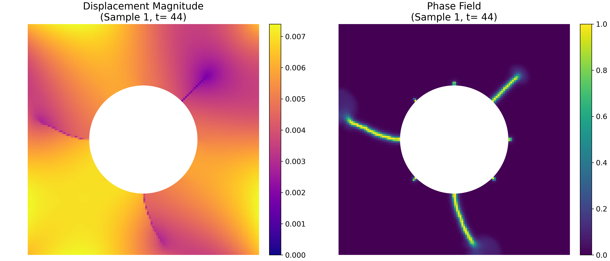
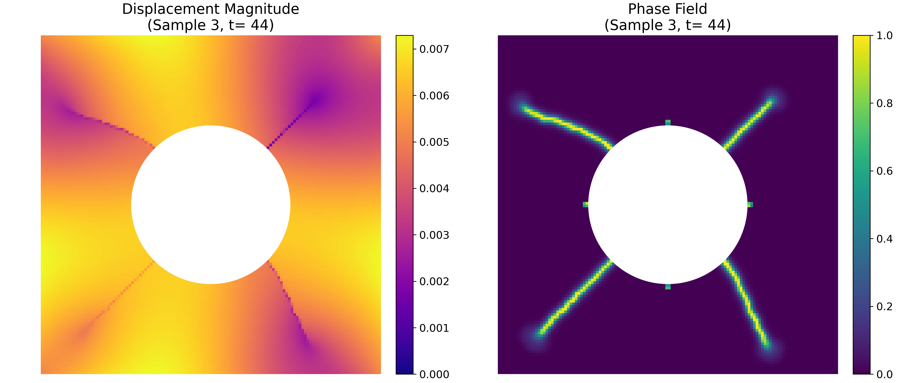

# Benchmark dataset: Phase Field fracture modeling in hyperelastic material with multiple cracks 
Hyperelastic multi-crack response studied under cyclic loading simulated with FEniCS

This dataset contains 1000 finite-element simulations of a 2D square specimen with a circular cavity and eight pre-cracks, subjected to tension, unloading, and compression using a large-deformation Neo-Hookean phase-field formulation.

---

## Full Dataset  
Our complete collection comprises **1000** distinct Gaussian-random-field-driven boundary-condition realizations. The full dataset is available in JHU archive at: https://archive.data.jhu.edu/dataset.xhtml?persistentId=doi:10.7281/T1XFF19O

<!--## This Repository Contains

1. **Dataset Generation Code**  
   - **`scripts/`**  
     - `bc_generator.m` — generates 100 GRF-based boundary conditions via Chebfun 
     - `simulator.py` — runs the phase-field fracture simulations in FEniCS   
     
2. **Sample Subset of Simulation Data**  
   - **`inputs.zip`** — contains `bc_displacement.mat` and `domain.xml` defining the boundary conditions and mesh  
   - **`simulation_results.zip`** — contains `realization_{i}/` (for i = 1…96) with raw `.npy` fields (`displacement_field`, `phase_field`, `elastic_energy`, `fracture_energy`), load-displacement text files, and snapshot images 

3. **ML Data Preparation & Visualization**  
   - `pre_processor.py` — maps raw fields onto a uniform 128×128 grid and creates `train.npz` (900 samples) and `test.npz` (100 samples)  
   - `data_plotter.py` — example script to load and visualize displacement and phase-field results from the NPZ files -->  

---

## Visualizations

Below are first 3 samples with displacement and phase-field at the last timestep (figures), along with displacement and phase-field Evolution (animation):

**Displacement and Phase-Field at Final Step (figures)**

<p align="center">
  
</p>

<p align="center">
  
</p>

<p align="center">
  
</p>

**Displacement and Phase-Field Evolution (animation)**

<div align="center">
  
</div>

<div align="center">
  
</div>

<div align="center">
  
</div>

---

## Apllications of this dataset

### 1. Benchmarking Basic ML & DL Models  
Because the displacement and phase-field outputs are mapped to a uniform grid, this dataset is ideal for standard image-based architectures:

- **CNN Regression**  
  - Map boundary-condition fields (e.g. GRF displacement maps) to phase-field damage snapshots at a given timestep.  
  - Compare network depths, receptive fields, and training times to establish baseline performance (pixel-wise MSE, crack-region IoU).

- **U-Net for Temporal Evolution**  
  - Formulate crack propagation as a sequence-prediction or segmentation task: predict the next phase-field frame from the current/previous few frames.  
  - Exploit skip-connections to preserve fine crack-tip features while modeling large-scale damage patterns.

- **Transfer Learning & Augmentation**  
  - Fine-tune pretrained vision backbones on these fracture snapshots to accelerate convergence.  
  - Apply rotations, flips, and local noise to augment the 900 “train” samples and evaluate robustness.

### 2. Scientific Machine Learning & AI4Science  
This dataset provides a playground for operator-learning and physics-informed methods:

- **Neural Operators (e.g., FNO, DeepONet)**  
  - Learn mappings from initial displacement function to time-series of phase-field and displacement in one shot.  
  - Leverage the uniform grid for efficient Fourier or kernel-based layers.

- **Physics-Informed Neural Operators**  
  - Incorporate PDE residuals (elastic equilibrium + phase-field evolution) as soft constraints alongside data losses.  
  - Use the provided energy fields to regularize models—e.g. enforce thermodynamic consistency of predicted energy dissipation.
  - Measure improvements in sample efficiency and generalization over purely data-driven or purely physics-driven approaches.

- **Hybrid FE–NN Surrogate Models**  
  - Fuse the provided FEM solver with a neural network backbone to build FE–NN surrogates that dramatically speed up forward simulations while retaining high physical fidelity.
  

### 3. Inverse Modeling  
Thanks to the elastic and fracture energy values included for the first 96 samples, this dataset supports advanced inverse analyses:

- **Material Parameter Estimation**  
  - Infer fracture toughness \(G_c\), regularization length \(\varepsilon\), or Young’s modulus by mapping observed energy distributions (plus damage maps) back to scalar model parameters.

- **Load Reconstruction**  
  - Given measured elastic-energy fields (e.g., from digital image correlation) and final crack geometries, invert for the most likely boundary-condition field that produced them.

---

## Cite our dataset

If you use this dataset in your work, please cite it as follows:

```
@data{T1XFF19O_2025,
author = {Hakimzadeh, Maryam and Graham-Brady, Lori and Goswami, Somdatta},
publisher = {Johns Hopkins Research Data Repository},
title = {{Data and code associated with: Phase-Field Fracture Simulation Dataset: Hyperelastic Multi-Crack Response Under Loading and Unloading}},
year = {2025},
version = {V2},
doi = {10.7281/T1XFF19O},
url = {https://doi.org/10.7281/T1XFF19O}
}
```
---

## Contact

In case you need more information, please feel free to contact Dr. Maryam Hakimzadeh (@mhakimz1@jhu.edu), Prof. Lori Graham Brady (lori@jhu.edu), or Prof. Somdatta Goswami (somdatta@jhu.edu). 
