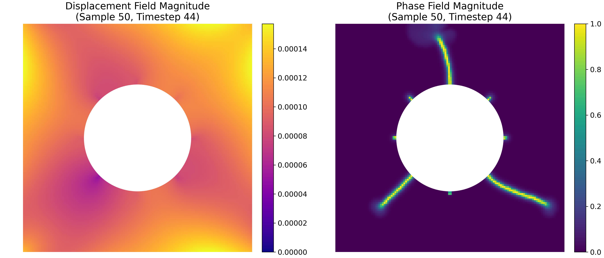

# Phase-Field-Fracture-Dataset  
Hyperelastic multi-crack response under cyclic loading simulated with FEniCS

This dataset contains 1000 finite-element simulations of a 2D square specimen with a circular cavity and eight pre-cracks, subjected to tension, unloading, and compression using a large-deformation Neo-Hookean phase-field formulation.

## Full Dataset  
Our complete collection comprises **1000** distinct Gaussian-random-field-driven boundary-condition realizations. The full dataset is available in JHU archive at: https://archive.data.jhu.edu/dataset.xhtml?persistentId=doi:10.7281/T1XFF19O

<!--## This Repository Contains

1. **Dataset Generation Code**  
   - **`scripts/`**  
     - `bc_generator.m` — generates 100 GRF-based boundary conditions via Chebfun 
     - `simulator.py` — runs the phase-field fracture simulations in FEniCS   
     
2. **Sample Subset of Simulation Data**  
   - **`inputs.zip`** — contains `bc_displacement.mat` and `domain.xml` defining the boundary conditions and mesh  
   - **`simulation_results.zip`** — contains `realization_{i}/` (for i = 1…96) with raw `.npy` fields (`displacement_field`, `phase_field`, `elastic_energy`, `fracture_energy`), load-displacement text files, and snapshot images 

3. **ML Data Preparation & Visualization**  
   - `pre_processor.py` — maps raw fields onto a uniform 128×128 grid and creates `train.npz` (900 samples) and `test.npz` (100 samples)  
   - `data_plotter.py` — example script to load and visualize displacement and phase-field results from the NPZ files -->  

## Visualizations

**Displacement and Crack Evolution (static frames)**  

  

**Displacement and Phase-Field Evolution (animation)**  

   

